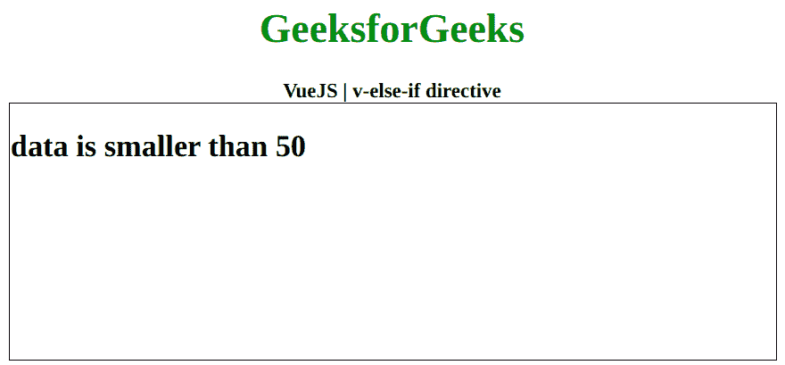
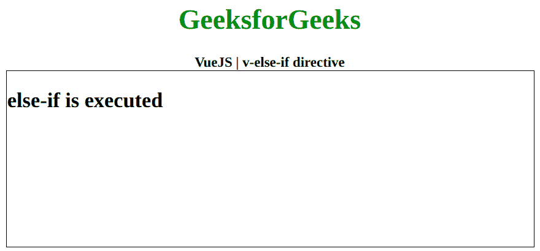

# Vue . js 中的 v-else-if 指令

> 原文:[https://www . geesforgeks . org/v-else-if-direction-in-vue-js/](https://www.geeksforgeeks.org/v-else-if-directive-in-vue-js/)

**v-else-if** 指令是一个 [**Vue.js**](https://www.geeksforgeeks.org/vue-js-introduction-installation/) 指令，用于在不满足 if 条件时根据条件切换元素的显示 CSS 属性。首先，我们将创建一个 id 为 *app* 的 div 元素，让我们将 *v-else-if* 指令应用到一个有数据的元素。现在我们将通过用包含该值的数据属性初始化一个 Vue 实例来创建这个数据。

**语法:**

```js
v-else-if="data"
```

**参数:**该函数接受单个参数，即数据或条件。

**示例 1:** 本示例使用 Vue.js 来显示带有 v-else-if 的元素，使用算术条件。

```js
<!DOCTYPE html>
<html>

<head>
    <title>
        VueJS | v-else-if directive
    </title>

    <!-- Load Vuejs -->
    <script src=
"https://cdn.jsdelivr.net/npm/vue/dist/vue.js">
    </script>
</head>

<body>
    <div style="text-align: center;
            width: 600px;">
        <h1 style="color: green;">
            GeeksforGeeks
        </h1>
        <b>
            VueJS | v-else-if directive
        </b>
    </div>

    <div id="canvas" style=
        "border:1px solid #000000;
        width: 600px;height: 200px;">

        <div id="app">
            <h2 v-if="data > 50">
                data is greater than 50
            </h2>
            <h2 v-else-if="data < 50">
                data is smaller than 50
            </h2>
            <h2 v-else>
                data is equal to 50
            </h2>
        </div>
    </div>

    <script>
        var app = new Vue({
            el: '#app',
            data: {
                data: 40
            }
        })
    </script>
</body>

</html>            
```

**输出:**



**示例 2:** 这个示例使用 Vue.js 来显示带有 v-else 的元素——如果使用 Booleans 的话。

```js
<!DOCTYPE html>
<html>

<head>
    <title>
        VueJS | v-else-if directive
    </title>

    <!-- Load Vuejs -->
    <script src=
"https://cdn.jsdelivr.net/npm/vue/dist/vue.js">
    </script>
</head>

<body>
    <div style="text-align: center;
        width: 600px;">

        <h1 style="color: green;">
            GeeksforGeeks
        </h1>
        <b>
            VueJS | v-else-if directive
        </b>
    </div>

    <div id="canvas" style=
        "border:1px solid #000000;
        width: 600px;height: 200px;">

        <div id="app">
            <h2 v-if="data">
                if is executed
            </h2>
            <h2 v-else-if="!data">
                else-if is executed
            </h2>
        </div>
    </div>

    <script>
        var app = new Vue({
            el: '#app',
            data: {
                data: false
            }
        })
    </script>
</body>

</html>                   
```

**输出:**

