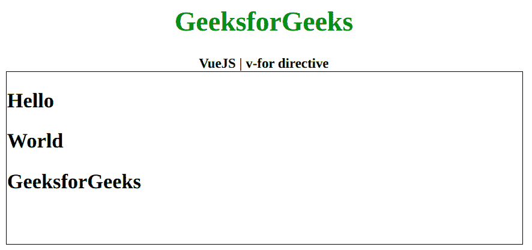

# v-表示 Vue.js 中的指令

> 原文:[https://www.geeksforgeeks.org/v-for-directive-in-vue-js/](https://www.geeksforgeeks.org/v-for-directive-in-vue-js/)

**v-for** 指令是一个 [**Vue.js**](https://www.geeksforgeeks.org/vue-js-introduction-installation/) 指令，用于循环数据，通常是数组或对象。首先，我们将创建一个 id 为 *app* 的 div 元素，让我们将 *v-for* 指令应用到一个有数据的元素。现在我们将通过用包含该值的数据属性初始化一个 Vue 实例来创建这个数据。

**语法:**

```js
v-for="data in datas"
```

**参数:**这个函数接受的数据要么是数组，要么是我们将要循环的对象。

**示例:**本示例使用 Vue.js 循环遍历带有 v-for 的数组。

```js
<!DOCTYPE html>
<html>

<head>
    <title>
        VueJS | v-for directive
    </title>

    <!-- Load Vuejs -->
    <script src=
"https://cdn.jsdelivr.net/npm/vue/dist/vue.js">
    </script>
</head>

<body>
    <div style="text-align: center;
        width: 600px;">

        <h1 style="color: green;">
            GeeksforGeeks
        </h1>

        <b>
            VueJS | v-for directive
        </b>
    </div>

    <div id="canvas" style=
        "border:1px solid #000000;
        width: 600px;height: 200px;">

        <div id="app">
            <h2 v-for="data in datas">
                {{data}}
            </h2>
        </div>
    </div>

    <script>
        var app = new Vue({
            el: '#app',
            data: {
                datas: [
                    'Hello', 
                    'World', 
                    'GeeksforGeeks'
                ]
            }
        })
    </script>
</body>

</html>
```

**输出:**

