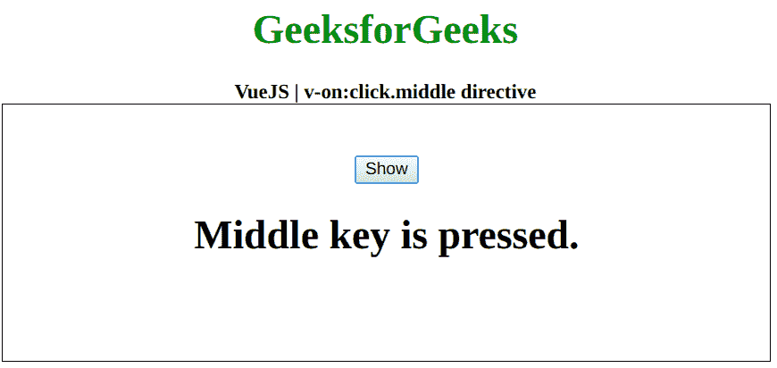

# v-on:在 Vue.js 中点击. middle 指令

> 哎哎哎:# t0]https://www . geeksforgeeks . org/v-onclick-middle directive-in-view-js/

**v-on:click.middle** 指令是一个 [**Vue.js**](https://www.geeksforgeeks.org/vue-js-introduction-installation/) 指令，用来给元素添加一个 click 事件监听器。虽然 click 指令会为所有类型的单击触发事件，但该指令仅在单击鼠标中键时触发事件。首先，我们将创建一个 id 为 *app* 的 div 元素，让我们将 *v-on:click.middle* 指令应用于一个元素。此外，我们甚至可以在点击发生时执行一个功能。

**语法:**

```js
v-on:click.middle="function"
```

**参数:**该功能保存点击事件发生时将执行的功能。

**示例:**本示例使用 Vue.js 通过 v-on:click.middle 切换元素的可见性。

```js
<!DOCTYPE html>
<html>

<head>
    <title>
        VueJS v-on:click.middle directive
    </title>

    <!-- Load Vuejs -->
    <script src=
"https://cdn.jsdelivr.net/npm/vue/dist/vue.js">
    </script>
</head>

<body>
    <div style="text-align: center;
        width: 600px;">

        <h1 style="color: green;">
            GeeksforGeeks
        </h1>
        <b>
            VueJS | v-on:click.middle directive
        </b>
    </div>

    <div id="canvas" style=
        "border:1px solid #000000;
        width: 600px;height: 200px;">

        <div id="app" style=
            "text-align: center; 
            padding-top: 40px;">

            <button v-on:click.middle=
                "data = !data">
                Show
            </button>

            <h1 v-if="data">
                Middle key is pressed.
            </h1>
        </div>
    </div>

    <script>
        var app = new Vue({
            el: '#app',
            data: {
                data: false
            }
        })
    </script>
</body>

</html>
```

**输出:**

