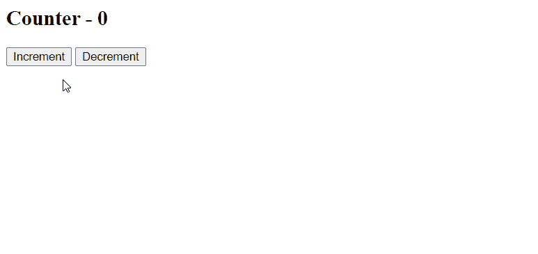
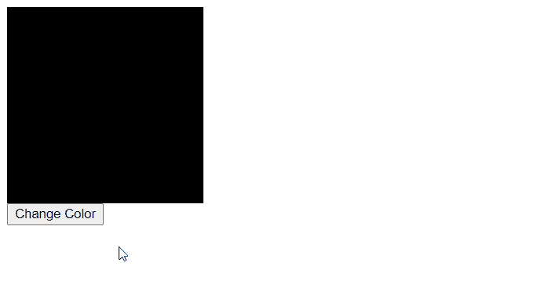

# vista . js 点击事件

> 哎哎哎:# t0]https://www . geeksforgeeks . org/view-js-click-event/

Vue.js 是一个用于构建用户界面的渐进式框架。核心库只专注于视图层，并且易于获取和与其他库集成。Vue 还完全能够结合现代工具和支持库为复杂的单页应用程序提供动力。

v-on 指令用于让用户与应用程序交互。它可以附加到调用 Vue 实例上的方法的事件侦听器。这允许在点击事件发生时调用任何所需的功能。

**例 1:**

*   **文件名-索引. html:**

    ## 超文本标记语言

    ```js
    <html>
    <head>
        <script src=
    "https://cdn.jsdelivr.net/npm/vue@2/dist/vue.js">
      </script>
    </head>
    <body>
        <div id='parent'>
            <h2>Counter - {{counter}}</h2>
            <button v-on:click='increment'>
              Increment
              </button>
            <button v-on:click='decrement'>
              Decrement
              </button>
        </div>
        <script src='app.js'>
      </script>
    </body>
    </html>
    ```

*   **文件名- app.js:**

    ## java 描述语言

    ```js
    const parent = new Vue({
        el : '#parent',
        data : {
            counter : 0
        },
        methods: {
           increment : function(){
               this.counter += 1
           },
           decrement : function(){
               this.counter -= 1
           }
        }
    })
    ```

**输出:**



**例 2:**

*   **文件名-索引. html:**

    ## 超文本标记语言

    ```js
    <html>
    <head>
        <script src=
    "https://cdn.jsdelivr.net/npm/vue@2/dist/vue.js">
          </script>
    </head>
    <body>
        <div id='parent'>
            <div id='box' 
                 style='height:200px; 
                        width:200px; 
                        background-color:black;'>
              </div>
            <button v-on:click="changeColor">
              Change Color
              </button>
        </div>
        <script src='app.js'></script>
    </body>
    </html>
    ```

*   **文件名- app.js:**

    ## java 描述语言

    ```js
    const parent = new Vue({
        el : '#parent',
        methods: {
            changeColor: function () {
                const box =
                  document.querySelector('#box')
                const red =
                  Math.floor(Math.random() * 256 + 1)
                const green =
                  Math.floor(Math.random() * 256 + 1)
                const blue =
                  Math.floor(Math.random() * 256 + 1)

                box.style.background =
                  "rgb("+red+", "+green+", "+blue+ ")"
            }
          }
    })
    ```

**输出:**

