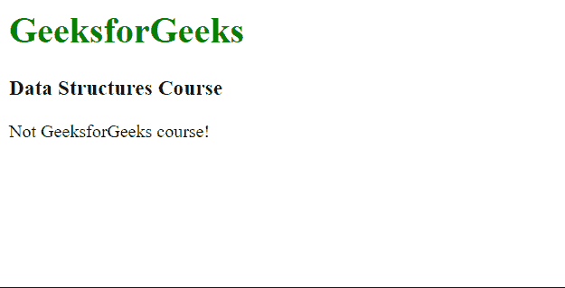

# Vue.js 条件渲染

> 原文:[https://www.geeksforgeeks.org/vue-js-conditional-rendering/](https://www.geeksforgeeks.org/vue-js-conditional-rendering/)

**[Vue.js](https://www.geeksforgeeks.org/vue-js-introduction-installation/)** 是一个用于构建用户界面的渐进式框架。核心库只专注于视图层，并且易于获取和与其他库集成。Vue 还完全能够结合现代工具和支持库为复杂的单页应用程序提供动力。

Vue 中的条件渲染使得基于特定条件切换 DOM 中任何元素的存在变得容易。指令 **v-if** 和 **v-else** 用于此目的。

**v-if** 指令可用于有条件地渲染块。可以为它分配一个布尔变量，并根据它的值切换底层的 DOM 元素。 **v-else** 指令可用于渲染不满足 **v-if** 指令条件的块。该指令必须立即遵循 **v-if** 指令才能生效。 **v-else-if** 指令也可以用来链接多个条件句。

以下示例演示了 Vue.js 中的条件渲染:

**示例 1:** 在此示例中，如果 isVisible 变量为 true，则将显示 v-if 指令中给出的文本。

**文件名:index.html**

## 超文本标记语言

```
<html>
<head>
  <script src=
"https://cdn.jsdelivr.net/npm/vue@2/dist/vue.js">
  </script>
</head>
<body>
  <div id='parent'>
    <h1 style="color: green">
      GeeksforGeeks
    </h1>
    <strong v-if="isVisible">
      This text is visible!
    </strong>
  </div>
  <script src='app.js'></script>
</body>
</html>
```

**文件名:app.js**

## java 描述语言

```
const parent = new Vue({
  el : '#parent',
  data : 

    // Data is interpolated
    // in the DOM
    isVisible: false
  }
})
```

**输出:**


**例 2:**

**文件名:index.html**

## 超文本标记语言

```
<html>
<head>
  <script src=
"https://cdn.jsdelivr.net/npm/vue@2/dist/vue.js">
  </script>
</head>
<body>
  <div id='parent'>
    <h1 style="color: green">
      GeeksforGeeks
    </h1>
    <h3>Data Structure Course</h3>
    <p v-if='gfg'>
      GeeksforGeeks Self paced Data Structure
      course is Awesome!
    </p>

    <p v-else>
      Not GeeksforGeeks course!
    </p>

  </div>
  <script src='app.js'></script>
</body>
</html>
```

**文件名:app.js**

## java 描述语言

```
const parent = new Vue({
  el : '#parent',
  data : {

    // Data is interpolated
    // in the DOM
    gfg: true
  }
})
```

**输出:**

*   当 *gfg* 变量设置为真时


*   当 *gfg* 变量设置为假时

