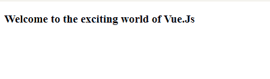
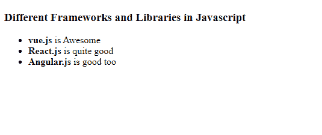

# Vue.js 声明性渲染

> 原文:[https://www.geeksforgeeks.org/vue-js-declarative-rendering/](https://www.geeksforgeeks.org/vue-js-declarative-rendering/)

**[Vue.js](https://www.geeksforgeeks.org/vue-js-introduction-installation/)** 是一个用于构建用户界面的渐进式框架。核心库只专注于视图层，并且易于获取和与其他库集成。Vue 还完全能够结合现代工具和支持库为复杂的单页应用程序提供动力。

Vue 中的声明性呈现使我们能够使用简单的模板语法将数据呈现到 DOM 中。双花括号用作占位符来插入 DOM 中所需的数据。

以下示例演示了 Vue.js 中的声明性呈现:

**例 1:**

**文件名:index.html**

## 超文本标记语言

```js
<html>
<head>
    <script src=
"https://cdn.jsdelivr.net/npm/vue@2/dist/vue.js">
    </script>
</head>
<body>
    <div id='parent'>
        <h3>
          Welcome to the exciting world of {{name}}
          </h3>
        <script src='app.js'>
      </script>
    </div>
</body>
</html>
```

**文件名:app.js**

## java 描述语言

```js
const parent = new Vue({
    el : '#parent',
    data : {

        // The data that will be
        // interpolated in the DOM
        name : 'Vue.Js'
    }
})
```

**输出:**



声明性呈现

**例 2:**

**文件名:index.html**

## 超文本标记语言

```js
<html>
<head>
    <script src=
"https://cdn.jsdelivr.net/npm/vue@2/dist/vue.js">
  </script>
</head>
<body>
    <div id='parent'>
        <h3>
          Different Frameworks and
          Libraries in Javascript
          </h3>
        <ul>
            <li>
              <strong>{{priority1}}</strong>
              is Awesome
            </li>
            <li>
              <strong>{{priority2}}</strong> 
              is quite good
            </li>
            <li>
              <strong>{{priority3}}</strong> 
              is good too
            </li>
        </ul>
        <script src='app.js'></script>
    </div>
</body>
</html>
```

**文件名:app.js**

## java 描述语言

```js
const parent = new Vue({
    el : '#parent',
    data : {

        // The data that will be
        // interpolated in the DOM
        priority1: "vue.js",
        priority2: "React.js",
        priority3: "Angular.js"
    }
})
```

**输出:**



声明性呈现