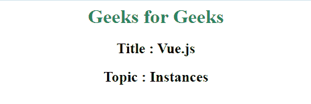
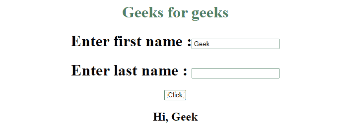

# vista . js instances

> 哎哎哎:# t0]https://www . geeksforgeeks . org/view-js-instances/

Vue.js 应用程序以 Vue 实例开始。**实例**对象是我们 Vue 应用程序的主要对象。它帮助我们在应用程序中使用 Vue 组件。Vue 实例使用 MVVM(模型-视图-视图-模型)模式。Vue 构造函数接受一个叫做 options 对象的 JavaScript 对象。当你实例化一个 Vue 实例时，你需要传递一个 options 对象，它可以包含数据、方法、元素、模板等选项。

**语法:**

```js
var app = new Vue({
   // options
});

```

**方法:**首先，我们需要创建一个使用 Vue 的对象，并将其分配给变量 app。在 Vue 中，有一个名为 **el** 的参数，它获取 DOM 元素的 id。所以我们将创建一个 id 为 **home** 的 div 元素。Vue 元素将仅在此 id(#home)内工作。我们可以在这个数据对象内部分配参数值。

在下面的例子中，我们使用 Vue.js 来展示实例的工作方式。

**例 1:**

## 超文本标记语言

```js
<!DOCTYPE html>
<html>

<head>
    <script src="https://unpkg.com/vue">
    </script>
</head>

<body>
    <div style="text-align: center;" id="home">

        <!-- Rendering data to DOM -->
        <h1 style="color: seagreen;">{{title}}</h1>
        <h2>Title : {{name}}</h2>
        <h2>Topic : {{topic}}</h2>
    </div>

    <script type="text/javascript">
        // Creating Vue Instance
        var app = new Vue({
            // Assigning id of DOM in parameter
            el: '#home',
            // Assigning values of parameters
            data: {
                title: "Geeks for Geeks",
                name: "Vue.js",
                topic: "Instances"
            }
        });
    </script>
</body>

</html>
```

**输出:**



App 视图

**例 2:**

## 超文本标记语言

```js
<!DOCTYPE html>
<html>

<head>
    <script src="https://unpkg.com/vue">
    </script>
</head>

<body>
    <div style="text-align: center;" id="home">

        <!-- Rendering data to DOM -->
        <h1 style="color: seagreen;">
            {{title}}
        </h1>
        <h1>Enter first name :
            <input type="text" id="firstname">
        </h1>
        <h1>Enter last name : 
            <input type="text" id="lastname">
        </h1>
        <button @click="fullname()">Click</button>
        <h2 id="full_name"></h2>
    </div>
</body>

<script type="text/javascript">
    // Creating Vue Instance
    var app = new Vue({
        // Setting id of DOM in parameter
        el: '#home',
        // Passing datas
        data: {
            title: "Geeks for geeks",
        },
        methods: {
            fullname: function () {
                // Getting values from inputs
                var first_name = document
                    .getElementById("firstname").value

                var last_name = document
                    .getElementById("lastname").value

                // Setting text in element
                document.getElementById("full_name")
                    .innerHTML = "Hi, " + first_name 
                    + " " + last_name
            }
        }
    });
</script>

</html>
```

**输出:**

