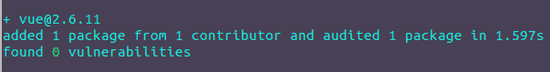
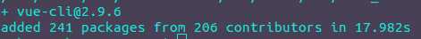
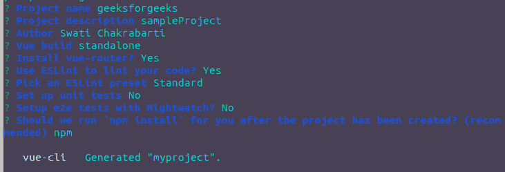
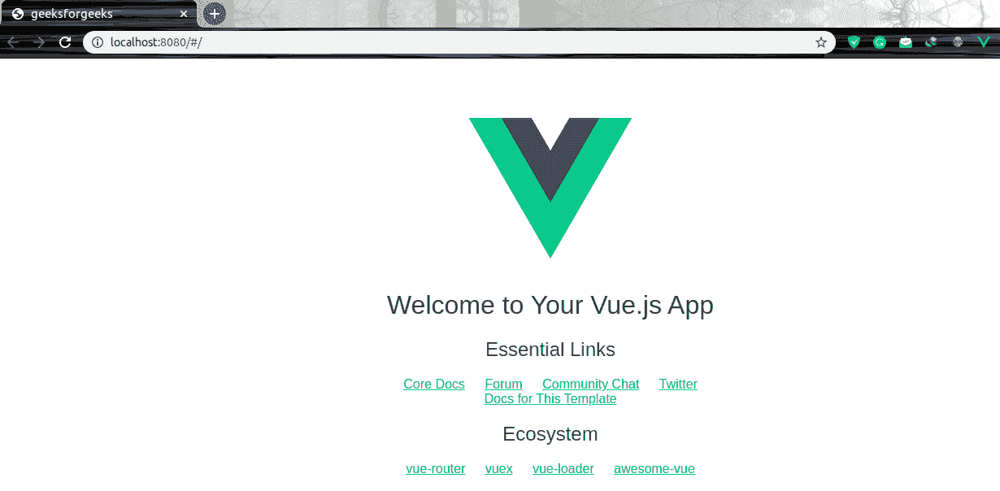

# vista . js | introduction&安装

> 哎哎哎:# t0]https://www . geeksforgeeks . org/view-js-introduction-installation/

VueJS 是像 ReactJS 这样的 JavaScript 的最佳框架之一。VueJS 用于设计用户界面层，对于任何开发人员来说都很容易上手。它也与其他库和扩展兼容。如果你想创建一个单页应用程序，那么 VueJS 在我看来是首选。在开发领域，可能有很多问题是用单一的库无法解决的，所以 VueJS 与其他库兼容，所以你可以轻松地去做。所有流行的浏览器都支持 VueJS，比如 Chrome、火狐、IE、Safari 等。您可以轻松地将此库与您最喜欢的库进行比较。

*   【ReactJS 和 Vue.js 的区别
*   【VueJS 和 AngularJS 的区别

**真空吸尘器的安装:**真空吸尘器可以通过以下三种不同的方式使用:

*   直接包含的 CDN 文件。
*   通过 npm 安装。
*   通过 CLI 使用 vuejs

**直接包含 CDN 文件:**需要下载 VueJS [**开发版**](https://vuejs.org/js/vue.js)[**生产版**](https://vuejs.org/js/vue.min.js) 然后将其包含在脚本标签中。
**CDN:**

1.  出于学习目的，您可以使用以下脚本(带具体版本):

2.  对于 ES 模块兼容，使用以下脚本:

**通过 npm 安装:**在应用此程序之前，您必须已经安装了 npm，要检查 npm 是否已安装，请运行以下命令:

```js
npm -v
```

如果没有，您可以通过 node.js 安装过程来安装:

1.  [在 Windows 上安装 node . js](https://www.geeksforgeeks.org/installation-of-node-js-on-windows/)
2.  [在 Linux 上安装 node . js](https://www.geeksforgeeks.org/installation-of-node-js-on-linux/)

现在，您已经准备好安装 VueJS 了，为此，请运行下面的命令。它将安装最新稳定版本的 VueJS。

```js
npm install vue
```



**通过 CLI 使用 VueJS:** 打开您的终端或命令提示符，运行以下命令。

```js
npm install --global vue-cli
```



**让我们通过 webpack 创建一个项目:**

*   **步骤 1:** 运行下面的命令创建项目。

```js
vue init webpack myproject

```



*   **步骤 2:** 现在使用下面的命令进入 myproject 文件夹。

```js
cd myproject

```

*   **步骤 3:** 运行下面的命令，在本地运行您的项目。

```js
npm run dev

```

