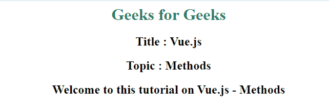

# Vue.js 方法

> 原文:[https://www.geeksforgeeks.org/vue-js-methods/](https://www.geeksforgeeks.org/vue-js-methods/)

Vue **方法**是与 Vue 实例相关联的对象。功能在**方法**对象中定义。当您需要对元素执行一些带有 **v-on** 指令的操作来处理事件时，方法非常有用。可以进一步调用在 methods 对象中定义的函数来执行操作。

**语法:**

```js
methods : {
  // We can add our functions here
}
```

**单文件组件语法:**

```js
export default {
  methods: {
    // We can add our functions here
  }
}
```

在下面的例子中，我们使用 Vue.js 来展示方法的工作原理。

**例 1:**

## 超文本标记语言

```js
<!DOCTYPE html>
<html>

<head>
     <script src=
        "https://unpkg.com/vue">
    </script>
</head>

<body>

    <div style="text-align: center;" id = "home">

         <!-- Rendering data to DOM -->
        <h1 style="color: seagreen;">{{title}}</h1>
        <h2>Title : {{name}}</h2>
        <h2>Topic : {{topic}}</h2>
        <!-- Calling function in methods -->
        <h2>{{show()}}</h2>

    </div>

</body>
<script type="text/javascript">

    // Creating Vue Instance
    var  vm = new Vue({

        // Assigning id of DOM in parameter
        el: '#home',
        // Assigning values of parameter
        data: {
            title : "Geeks for Geeks",
            name  : "Vue.js",
            topic : "Instances"
        },

        // Creating methods
        methods : {

            // Creating function
            show: function(){
                return "Welcome to this tutorial on "
                    + this.name + " - " + this.topic;
            }
        }
    });
</script>

</html>
```

**输出:**



App 视图

**例 2:**

## 超文本标记语言

```js
<!DOCTYPE html>
<html>

<head>
    <script src=
        "https://unpkg.com/vue">
    </script>
</head>

<body>
    <div style="text-align: center;" id = "home">

        <!-- Rendering data to DOM -->
        <h1 style="color: seagreen;">{{title}}</h1>
        <h2>Title : {{name}}</h2>

        <!-- Calling function in methods -->
        <button @click="show()">Click me</button>
        <h2 id="view"></h2>
    </div>
</body>

<script type="text/javascript">

    // Creating Vue Instance
    var  vm = new Vue({

        // Assigning id of DOM in parameter
        el: '#home',

        // Assigning values of parameter
        data: {
            title : "Geeks for Geeks",
            name  : "Vue.js | Methods",
        },

        // Creating methods
        methods : {

            // Creating function
            show: function(){
                    // Setting text in element
                    document.getElementById("view")
                      .innerHTML = "Hi, This is Vue"

                    // Hiding text after 2 seconds
                    setTimeout(() => {
                        document.getElementById("view")
                           .innerHTML = ""
                    }, 2000);
                }
            }
    });
</script>

</html>
```

**输出:**

*   **点击按钮前:**


点击前

*   **点击按钮后:**


点击后