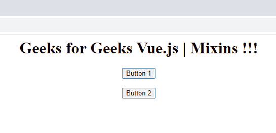
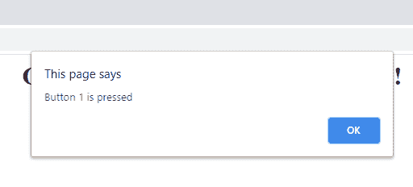
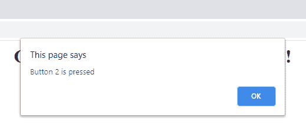

# vista . js mixin

> 哎哎哎:# t0]https://www . geeksforgeeks . org/view-js-mixins/

**Mixins–**Mixins 用于在执行相同动作的 Vue 组件中**重用代码**。Mixins 就像 C 编程中的函数。我们可以在 mixins 中定义一些动作，并在必要的地方使用它。在 mixins 的帮助下，代码的可重用性很简单。

**Vue 中有两种类型的 mixin:-**

**1。本地 mixin–**本地 mixin 仅在我们使用 Vue 组件中的 mixin 对象时起作用。在这里，我们将使用本地 mixins。

**语法:**

```
const MixinObjectName = {
    methods: {
        // you can write your methods here
    }
}

```

**2。全局 mixin–**如果我们需要 Vue 中所有组件的相同功能，我们可以使用全局 mixin。全局混合影响每个 Vue 组件。

全局混合的一个小例子:

```
// Creating global mixin
Vue.mixin({
  created: function () {
    var example = this.$options.example
    if (example) {
      console.log(example)
    }
  }
})

new Vue({
  example: 'This is Vue!!'
})

```

```
Output: This is Vue!!
```

**先决条件:**

*   Js 视图

**方法:**首先，我们将创建一个没有 mixin 的 Simple Vue.js 应用程序，它会在按钮点击时显示一个警报。

**检视应用程式:**

## 超文本标记语言

```
<!DOCTYPE html>
<html>

<head>
    <title>Mixins</title>
</head>

<body>
    <div id="app">
        <h1 style="text-align:center;">
            {{ message }}
        </h1>

        <!-- Adding components to HTML -->

        <my-comp1 style="text-align:center;">
        </my-comp1><br>
        <my-comp2 style="text-align:center;">
        </my-comp2>

    </div>
    <script src="https://unpkg.com/vue"></script>

    <script>
        // Creating component 1
        const myComp1 = {
            template: 
`<div><button @click="pressed('Button 1 is pressed')">Button 1</button> </div>`,

            // Creating method which shows 
            // alert on button click
            methods: {
                pressed(val) {
                    alert(val);
                }
            }
        }

        // Creating component 2  
        const myComp2 = {
            template: 
`<div><button @click="pressed('Button 2 is pressed')">Button 2</button></div>`,

            // Creating method which shows alert on button click
            methods: {
                pressed(val) {
                    alert(val);
                }
            }
        }

        // Creating vue app 
        new Vue({
            el: '#app',
            data() {
                return {
                    message: 'Geeks for Geeks Vue.js | Mixins !!!'
                }
            },

            // Defining components
            components: {
                myComp1: myComp1,
                myComp2: myComp2
            }
        });
    </script>
</body>

</html>
```

在上面的代码中，组件 1 和组件 2 执行相同的功能(警报消息)。我们为这两个组件编写了单独的函数。所以现在我们可以创建 mixins，并在不同的组件中重用相同的功能。

***为我们的应用创建 Mixin:***

```
const Mixin = {
    methods: {

    //creating method which shows alert on button click

    pressed(val){
        alert(val);
    }
 }
}

```

在上面的代码中，我们为 Mixin 创建了一个对象 ***Mixin*** ，并在其中定义了我们的函数。所以现在我们可以在组件中使用这个 Mixin 对象。

***将 mixin 添加到现有代码:***

## 超文本标记语言

```
<!DOCTYPE html>
<html>

<head>
    <title>Mixins</title>
</head>

<body>
    <div id="app">
        <h1 style="text-align:center;">
            {{ message }}
        </h1>

        <!-- Adding components to HTML -->
        <my-comp1 style="text-align:center;">
        </my-comp1><br />
        <my-comp2 style="text-align:center;">
        </my-comp2>
    </div>
    <script src="https://unpkg.com/vue"></script>

    <script>
        // Creating mixin 
        const Mixin = {

            // Creating method which shows 
            // alert on button click
            methods: {
                pressed(val) {
                    alert(val);
                }
            }
        }

        // Creating component 1
        const myComp1 = {
            template: 
`<div><button @click="pressed('Button 1 is pressed')">Button 1</button> </div>`,

            // Using mixin in component 1
            mixins: [Mixin]
        }

        // Creating component 2
        const myComp2 = {
            template: 
`<div><button @click="pressed('Button 2 is pressed')">Button 2</button></div>`,

            // Using mixin in component 2
            mixins: [Mixin]
        }

        // Creating vue app
        new Vue({
            el: '#app',
            data() {
                return {
                    message: 
                    'Geeks for Geeks Vue.js | Mixins !!!'
                }
            },

            // Defining components 
            components: {
                myComp1: myComp1,
                myComp2: myComp2
            }
        });
    </script>
</body>

</html>
```

**输出:**

**点击按钮前:**



App 视图

**点击按钮 1 时。**



按钮 1 点击

**点击按钮 2 时。**



按钮 2 点击