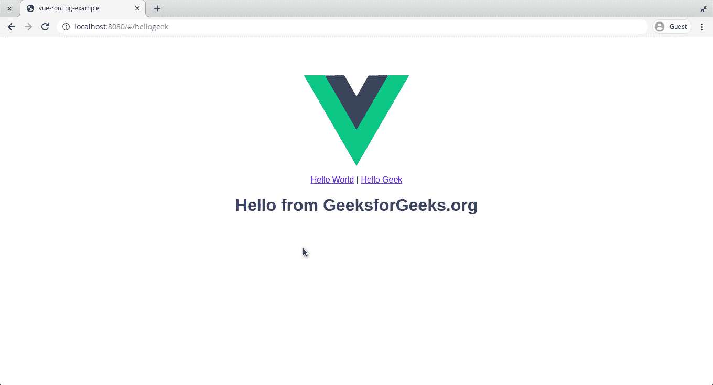

# vista . js |路由

> 哎哎哎:# t0]https://www . geeksforgeeks . org/view-js 路由/

**路由**是 [**Vue.js**](https://www.geeksforgeeks.org/vue-js-introduction-installation/) 提供的众多功能之一，允许用户在页面之间切换，无需每次加载页面都刷新。这导致页面之间的平滑过渡，给用户更好的感觉。
**设置应用程序:**首先，我们需要创建一个要处理的项目。我们可以为此使用命令行界面。打开终端，运行以下命令。

```js
vue init webpack vue-routing-example
```

在初始化过程中，确保在提示安装 **vue-router** 时回答是。为了在我们的应用程序中使用路由，这是必需的。初始化结束后，打开应用程序，通过在终端运行以下命令来检查过程是否成功:

```js
cd vue-routing-example
```

```js
npm run dev
```

有了这些命令，您的应用程序将被构建并部署到本地开发服务器中。
**href = " http://localhost:8080 "**
**构建我们的应用程序:**为了在我们的应用程序中实现路由，我们必须首先创建要路由到的页面。我们可以更改并使用 **HelloWorld.vue** 文件作为第一页，并在该组件文件夹**中创建一个新文件作为第二页。这些页面将没有任何功能，将用于理解路由的流程。** 

*   **第一步:**用下面的代码替换 **HelloWorld.vue** 的内容。**模板部分**是我们构造组件可见内容的地方。这里，它显示一个参数(msg)作为从代码的脚本部分传递给它的标题。**脚本部分**用于保存我们代码的逻辑，在这种情况下是返回值。
    **hello world . vue:**

## java 描述语言

```js
<template>
  <div class = 'helloworld'>
    <h1>{{ msg }}</h1>
    </div>
</template>

<script>
export default {
  name: 'HelloWorld',
  data () {
    return {
      msg: 'Hello World!'
    }
  }
}
</script>
```

*   **第二步:**将下面的代码粘贴到**hello gek . vue**文件中。对于**模板**和**脚本**部分，与 **HelloWorld.vue** 相同。
    **HelloGeek.vue:**
*   **步骤 3:** 现在我们已经准备好了页面，为了设置路由配置，我们需要配置我们的 **index.js** 文件。
    *   在导入部分，我们已经导入了 **Vue** 和**路由器**来帮助构建我们的项目。我们还导入了我们想要发送到的页面–**hello world**和**hello gek**。
    *   **Vue.use(strong)** 用于确保在我们的项目中添加 Router 作为助手。
    *   路由配置是一个包含**路径**、**名称**和**组件**的 JavaScript 对象。我们需要将这个对象添加到 routes 数组中。我们可以为组件分配路径(网址)和名称。
    *   在这里，作为一种特殊情况，根路径被重定向到 HelloWorld 页面，因为根永远不应该为空。
*   **Ste 4(可选):**用户现在可以通过将 URL 更改为**http://localhost:8080/#/hello world**或**http://localhost:8080/#/hello gek**来手动路由到每个页面。但是让我们设置通过链接路由的方法。
*   **第五步:**这里我们将进行路线链接，我们可以使用<路线链接>标签设置路线链接。**到**属性将被赋予一个我们需要路由的页面的路径。

```js
<router-link to="/helloworld">Hello World</router-link>
```

*   **模板部分**包含一个图像，后面是使用 **<路由器链接>** 标签到我们页面的路由链接。
*   **<路由器视图>** 占位符标签用于定义路由组件插入到 HTML 输出中的位置。
*   代码的**样式部分**有助于页面的样式化。
    T3】输出:

