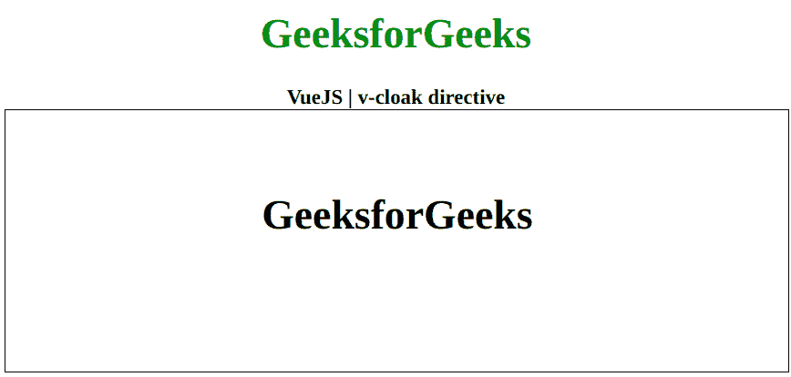

# vista . js v-cloak 指令

> 哎哎哎:# t0]https://www . geeksforgeeks . org/view-js-v-cloak 指令/

**v-斗篷**指令是一个 [**Vue.js**](https://www.geeksforgeeks.org/vue-js-introduction-installation/) 指令，它将保留在元素上，直到相关的 Vue 实例完成编译。结合***【v-斗篷】{ display: none }*** 等 CSS 规则，这个指令可以用来隐藏未编译的小胡子绑定，直到 Vue 实例准备好。首先，我们将创建一个 id 为 *app* 的 div 元素，让我们将*v-斗篷*指令应用于一个元素。

**语法:**

```
<element v-cloak></element>

```

**参数:**该函数不接受任何参数。

**示例:**这个示例使用 Vue.js 用 v-斗篷显示数据的工作情况，这样只有在编译完成时才可见。

## 超文本标记语言

```
<!DOCTYPE html>
<html>

<head>

    <!-- Load Vuejs -->
    <script src=
"https://cdn.jsdelivr.net/npm/vue/dist/vue.js">
    </script>

    <style>
        [v-cloak] {
            display: none;
        }
    </style>
</head>

<body>
    <div style="text-align: center;width: 600px;">

        <h1 style="color: green;">
            GeeksforGeeks
        </h1>
        <b>
            VueJS | v-cloak directive
        </b>
    </div>

    <div id="canvas" style=
            "border:1px solid #000000;
            width: 600px;height: 200px;">

        <div id="app" style=
            "text-align: center; 
            padding-top: 40px;">
            <h1 v-cloak>{{ data }}</h1>
        </div>
    </div>

    <script>
        var app = new Vue({
            el: '#app',
            data: {
                data: 'GeeksforGeeks'
            }
        })
    </script>
</body>

</html>              
```

**输出:**

