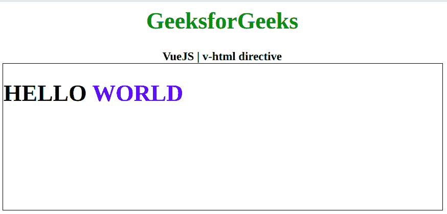

# vista . js | v-html 指令

> 哎哎哎:# t0]https://www . geeksforgeeks . org/view-js-v-html-directive/

**v-html** 指令是一个 [**Vue.js**](https://www.geeksforgeeks.org/vue-js-introduction-installation/) 指令，用于用我们的数据更新元素的内部 html。这是它与 v-text 的区别，这意味着当 v-text 接受字符串并将其视为字符串时，它将接受字符串并将其呈现为 HTML。首先，我们将创建一个 id 为 *app* 的 div 元素，让我们将 *v-html* 指令应用于该元素，并将数据作为消息。现在我们将通过用包含我们的消息的数据属性初始化一个 Vue 实例来创建这个消息。

**语法:**

```js
v-html="data"

```

**参数:**该指令接受单个参数，即数据。
**示例:**这个示例使用 VueJS 用 v-html 更新一个元素的 html。

## 超文本标记语言

```js
<!DOCTYPE html>
<html>

<head>
    <title>
        VueJS | v-html directive
    </title>

    <!-- Load Vuejs -->
    <script src=
"https://cdn.jsdelivr.net/npm/vue/dist/vue.js">
    </script>
    </script>
</head>

<body>
    <div style="text-align: center;width: 600px;">
        <h1 style="color: green;">
            GeeksforGeeks
        </h1>
        <b>
            VueJS | v-html directive
        </b>
    </div>

    <div id="canvas" style="border:1px solid #000000;
                            width: 600px;height: 200px;">
        <div v-html="message" id="app">
        </div>
    </div>

    <script>
        var app = new Vue({
            el: '#app',
            data: {
                message: '<h1>HELLO '+
                           '<span style="color:blue;">'+
                              'WORLD</span>'+
                         '</h1>'
            }
        })
    </script>
</body>

</html>
```

**输出:**

