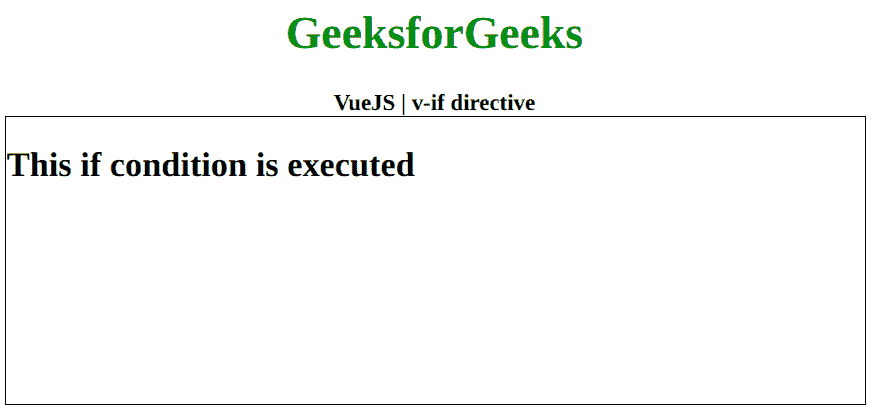
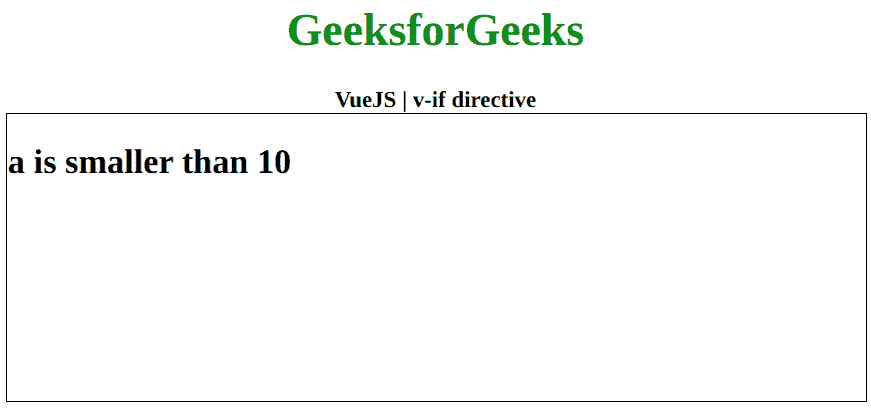

# vista . js | v-if 指令

> 哎哎哎:# t0]https://www . geeksforgeeks . org/view-js-v-if-directive/

**v-if** 指令是一个 [**Vue.js**](https://www.geeksforgeeks.org/vue-js-introduction-installation/) 指令，用于切换带有条件的元素的显示 CSS 属性。如果条件为真，它将使它可见，否则它将使它不可见。首先，我们将创建一个 id 为 *app* 的 div 元素，让我们将 *v-if* 指令应用于这个带有数据的元素。现在我们将通过用包含该值的数据属性初始化一个 Vue 实例来创建这个数据。

**语法:**

```js
v-if="data"

```

**参数:**该指令接受单个参数，即数据或条件。
**示例 1:** 此示例使用 VueJS 来显示带有 v-if 的元素。

## 超文本标记语言

```js
<!DOCTYPE html>
<html>

<head>
    <title>
        VueJS | v-if directive
    </title>

    <!-- Load Vuejs -->
    <script src=
"https://cdn.jsdelivr.net/npm/vue/dist/vue.js">
    </script>
</head>

<body>
    <div style="text-align: center;width: 600px;">
        <h1 style="color: green;">
            GeeksforGeeks
        </h1>
        <b>
            VueJS | v-if directive
        </b>
    </div>

    <div id="canvas" style="border:1px solid #000000;
                            width: 600px;height: 200px;">
        <div id="app">
            <h2 v-if="message">
              This if condition is executed
            </h2>
        </div>
    </div>

    <script>
        var app = new Vue({
            el: '#app',
            data: {
                message: true
            }
        })
    </script>
</body>
</html>
```

**输出:**



**示例 2:** 本示例使用 VueJS 来显示具有 v-if 算术条件的元素。

## 超文本标记语言

```js
<!DOCTYPE html>
<html>

<head>
    <title>
        VueJS | v-if directive
    </title>

    <!-- Load Vuejs -->
    <script src=
"https://cdn.jsdelivr.net/npm/vue/dist/vue.js">
    </script>
</head>

<body>
    <div style="text-align: center;width: 600px;">
        <h1 style="color: green;">
            GeeksforGeeks
        </h1>
        <b>
            VueJS | v-if directive
        </b>
    </div>

    <div id="canvas" style="border:1px solid #000000;
                            width: 600px;height: 200px;">
        <div id="app">
            <h2 v-if="a > 10">a is greater than 10</h2>
            <h2 v-if="a < 10">a is smaller than 10</h2>
            <h2 v-if="a == 10">a is equal to 10</h2>
        </div>
    </div>

    <script>
        var app = new Vue({
            el: '#app',
            data: {
                a: 9
            }
        })
    </script>
</body>
</html>
```

**输出:**

