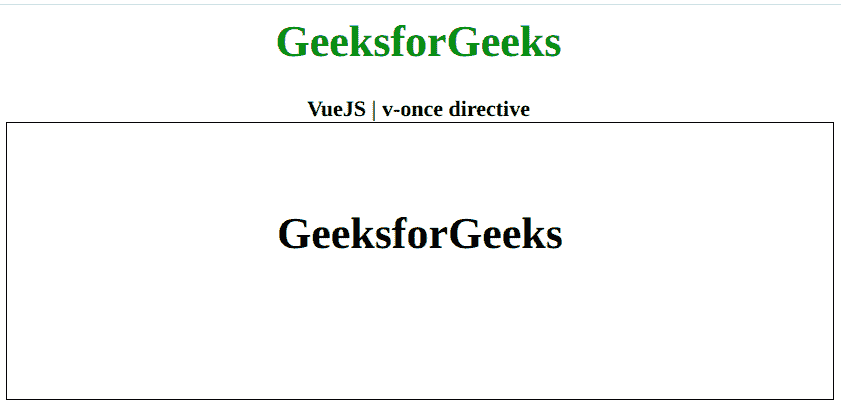

# vista . js v-11 指令

> 哎哎哎:# t0]https://www . geeksforgeeks . org/view-js-v-once-directive/

**v-once** 指令是一个 [**Vue.js**](https://www.geeksforgeeks.org/vue-js-introduction-installation/) 指令，用于避免元素不必要的重渲染。在第一次呈现元素一次后，它将元素视为静态内容。这提高了性能，因为它不必再次呈现。首先，我们将创建一个 id 为 choice 的 div 元素。然后将 *v-once* 指令应用于该元素，使其仅渲染一次。

**语法:**

```js
v-once
```

**参数:**此功能不接受任何参数。

**示例:**本示例使用 Vue.js 用 v-once 显示数据的工作情况。

```js
<!DOCTYPE html>
<html>

<head>
    <title>
        VueJS v-once Directive
    </title>

    <!-- Load Vuejs -->
    <script src=
"https://cdn.jsdelivr.net/npm/vue/dist/vue.js">
    </script>
</head>

<body>
    <div style="text-align: center;
              width: 600px;">
        <h1 style="color: green;">
            GeeksforGeeks
        </h1>

        <b>
            VueJS | v-once directive
        </b>
    </div>

    <div id="canvas" style=
        "border: 1px solid #000000;
        width: 600px; height: 200px;">
        <div id="app" style="text-align: center;
                padding-top: 40px;">
            <h1 v-once>{{ data }}</h1>
        </div>
    </div>
    <script>
        var app = new Vue({
            el: '#app',
            data: {
                data: 'GeeksforGeeks'
            }
        })
    </script>
</body>

</html>
```

**输出:**

