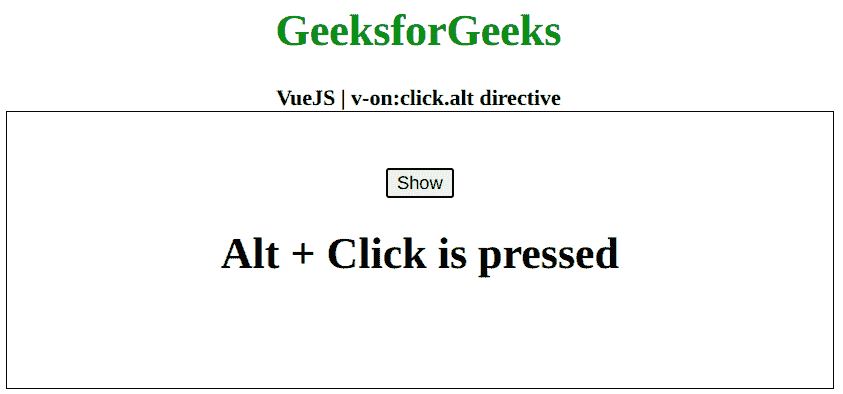

# vista . js v-on:点击. alt 指令

> 哎哎哎:# t0]https://www . geeksforgeeks . org/view-js-v-onclick-alt-directive/

**v-on:click.alt** 指令是一个 [**Vue.js**](https://www.geeksforgeeks.org/vue-js-introduction-installation/) 指令，用于向元素添加点击事件监听器。虽然 click 指令会为所有类型的单击触发事件，但该指令仅在按住 alt 键的同时单击时触发事件。首先，我们将创建一个 id 为 *app* 的 div 元素，让我们将 *v-on:click.alt* 指令应用于一个元素。此外，我们甚至可以在点击发生时执行一个功能。

**语法:**

```
v-on:click.alt = "function"
```

**参数:**该指令接受一个函数，当 Alt + click 事件发生时将执行该函数。

**示例:**下面的示例显示了使用 v-on:click.alt 切换元素可见性的 Vue.js。

```
<!DOCTYPE html>
<html>

<head>
    <title>
        VueJS v-on:click.alt directive
    </title>

    <!-- Load Vuejs -->
    <script src=
"https://cdn.jsdelivr.net/npm/vue/dist/vue.js">
    </script>
</head>

<body>
    <div style="text-align: center;width: 600px;">
        <h1 style="color: green;">
            GeeksforGeeks
        </h1>
        <b>
            VueJS | v-on:click.alt directive
        </b>
    </div>

    <div id="canvas" style=
            "border:1px solid #000000;
            width: 600px;height: 200px;">

        <div id="app" style=
            "text-align: center; 
            padding-top: 40px;">

            <button v-on:click.alt=
                "data = !data">Show
            </button>

            <h1 v-if="data">
                Alt + Click is pressed
            </h1>
        </div>
    </div>

    <script>
        var app = new Vue({
            el: '#app',
            data: {
                data: false
            }
        })
    </script>
</body>

</html>
```

**输出:**

