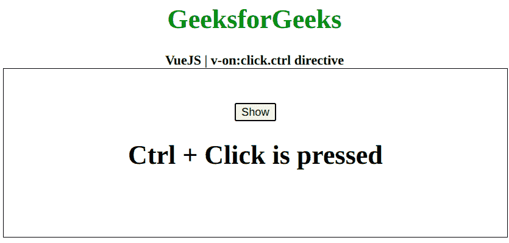

# vista . js v-on:点击. ctrl 指令

> 哎哎哎:# t0]https://www . geeksforgeeks . org/view-js-v-onclick-ctrl-directive/

**v-on:click.ctrl** 指令是一个 [**Vue.js**](https://www.geeksforgeeks.org/vue-js-introduction-installation/) 指令，用于向元素添加点击事件监听器。虽然点击指令触发各种点击事件，但该指令仅在点击的同时按下 **ctrl 键和**键时触发事件。首先，我们将创建一个 id 为 *app* 的 div 元素，让我们将 *v-on:click.ctrl* 指令应用于一个元素。此外，我们甚至可以在点击发生时执行一个功能。

**语法:**

```js
v-on:click.ctrl="function"
```

**参数:**该指令接受一个函数，当 Ctrl + click 事件发生时将执行该函数。

**示例:**本示例使用 VueJS 通过 v-on:click.ctrl 切换元素的可见性

## 超文本标记语言

```js
<!DOCTYPE html>
<html>

<head>
    <title>
        VueJS v-on:click.ctrl directive
    </title>

    <!-- Load Vuejs -->
    <script src=
"https://cdn.jsdelivr.net/npm/vue/dist/vue.js">
    </script>

</head>

<body>
    <div style="text-align: center;width: 600px;">

        <h1 style="color: green;">
            GeeksforGeeks
        </h1>

        <b>
            VueJS | v-on:click.ctrl directive
        </b>
    </div>

    <div id="canvas" style=
            "border:1px solid #000000;
            width: 600px;height: 200px;">

        <div id="app" style=
            "text-align: center; 
            padding-top: 40px;">
            <button v-on:click.ctrl=
                "data = !data">Show
            </button>

            <h1 v-if="data">
                Ctrl + Click is pressed
            </h1>
        </div>
    </div>

    <script>
        var app = new Vue({
            el: '#app',
            data: {
                data: false
            }
        })
    </script>
</body>

</html>
```

**输出:**按下显示按钮并按下 ctrl 键，可以看到以下输出。

