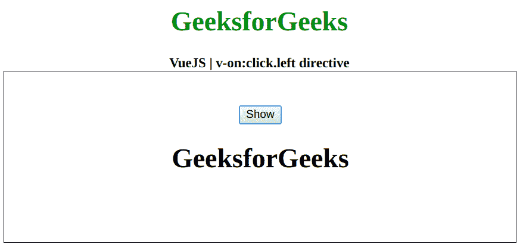

# Vue.js v-on:点击.左指令

> 哎哎哎:# t0]https://www . geeksforgeeks . org/view-js-v-onclick-left-directive/

**v-on:click.left** 指令是一个 [**Vue.js**](https://www.geeksforgeeks.org/vue-js-introduction-installation/) 指令，用于向元素添加点击事件监听器。虽然 click 指令会为所有类型的单击触发事件，但该指令仅在单击鼠标左键时触发事件。首先，我们将创建一个 id 为 *app* 的 div 元素，让我们将 *v-on:click.left* 指令应用于一个元素。此外，我们甚至可以在点击发生时执行一个功能。

**语法:**

```js
v-on:click.left = "function"
```

**参数:**该指令将函数指定为一个值，当点击事件发生时将执行该值。
**示例:**本示例使用 VueJS 切换元素的可见性。

## 超文本标记语言

```js
<!DOCTYPE html>
<html>

<head>
    <title>
        Vue.js v-on:click.left Directive
    </title>

    <!-- Load Vuejs -->
    <script src=
"https://cdn.jsdelivr.net/npm/vue/dist/vue.js">
    </script>
</head>

<body>
    <div style="text-align: center;width: 600px;">
        <h1 style="color: green;">
            GeeksforGeeks
        </h1>
        <b>
            VueJS | v-on:click.left directive
        </b>
    </div>

    <div id="canvas" style=
            "border:1px solid #000000;
            width: 600px;height: 200px;">

        <div id="app" style=
            "text-align: center; 
            padding-top: 40px;">
            <button v-on:click.left=
                "data = !data">Show
            </button>

            <h1 v-if="data">GeeksforGeeks</h1>
        </div>
    </div>

    <script>
        var app = new Vue({
            el: '#app',
            data: {
                data: false
            }
        })
    </script>
</body>

</html>      
```

**输出:**

