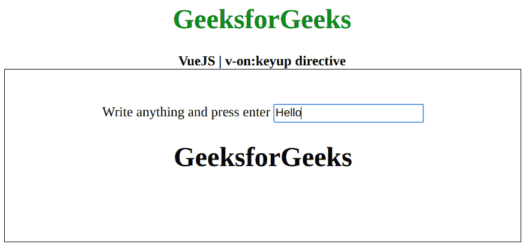

# vista . js v-on:key up 指令

> 哎哎哎:# t0]https://www . geeksforgeeks . org/view-js-v-monkey yup 指令/

**v-on:keyup** 指令是一个 [**Vue.js**](https://www.geeksforgeeks.org/vue-js-introduction-installation/) 指令，用来给键盘上的一个按钮添加一个事件监听器。首先，我们将创建一个 id 为 *app* 的 div 元素，并对输入元素应用 *v-on:keyup* 指令。此外，当我们按下关联键时，我们可以执行一个功能。

**语法:**

```js
v-on:keyup="function"
```

**支持的按键:**支持以下按键:

*   **回车键:**。进入
*   **Tab 键:**。标签
*   **删除键:**。删除
*   ESC 键:。esc 键
*   **向上键:**。向上
*   **向下键:**。向下
*   **左键:**。左边的
*   **右键:**。正确

**参数:**该指令将函数保存为一个值，该值将在关键事件发生时执行。
**示例:**本示例使用 VueJS 切换元素的可见性，使用回车键使用 v-on:keyup。

## 超文本标记语言

```js
<!DOCTYPE html>
<html>

<head>
    <title>
        VueJS v-on:keyup Directive
    </title>

    <!-- Load Vuejs -->
    <script src=
"https://cdn.jsdelivr.net/npm/vue/dist/vue.js">
    </script>
</head>

<body>
    <div style="text-align: center;
                width: 600px;">
        <h1 style="color: green;">
            GeeksforGeeks
        </h1>
        <b>
            VueJS | v-on:keyup directive
        </b>
    </div>

    <div id="canvas" style=
            "border:1px solid #000000;
            width: 600px;height: 200px;">

        <div id="app" style=
            "text-align: center; 
            padding-top: 40px;">
            Write anything and press enter

            <input v-on:keyup.enter=
                "data = !data">
            </input>

            <h1 v-if="data">GeeksforGeeks</h1>
        </div>
    </div>

    <script>
        var app = new Vue({
            el: '#app',
            data: {
                data: false
            }
        })
    </script>
</body>

</html>                   
```

**输出:**

