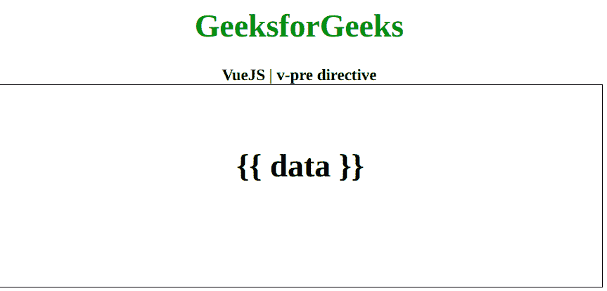

# vista . js v-预指令

> 哎哎哎:# t0]https://www . geeksforgeeks . org/view-js-v 预指令/

**v-pre** 指令是一个 [**Vue.js**](https://www.geeksforgeeks.org/vue-js-introduction-installation/) 指令，用于跳过这个元素及其所有子元素的编译。您可以使用它来显示未加工的胡子标签。首先，我们将创建一个 id 为 *app* 的 div 元素，让我们将 *v-pre* 指令应用于一个元素。此外，我们可以使用一个标题元素来显示数据。

**语法:**

```
v-pre
```

**参数:**本指令不接受任何参数。

**示例:**本示例使用 Vue.js 展示 v-pre 指令的工作原理。

## 超文本标记语言

```
<!DOCTYPE html>
<html>

<head>
    <title>
        VueJS | v-pre directive
    </title>

    <!-- Load Vuejs -->
    <script src=
"https://cdn.jsdelivr.net/npm/vue/dist/vue.js">
    </script>
</head>

<body>
    <div style="text-align: center;width: 600px;">
        <h1 style="color: green;">
            GeeksforGeeks
        </h1>
        <b>
            VueJS | v-pre directive
        </b>
    </div>

    <div id="canvas" style=
        "border:1px solid #000000;
        width: 600px;height: 200px;">

        <div id="app" style="text-align: center; 
                    padding-top: 40px;">
            <h1 v-pre>{{ data }}</h1>
        </div>
    </div>

    <script>
        var app = new Vue({
            el: '#app',
            data: {
                data: 'Hello'
            }
        })
    </script>
</body>

</html>                   
```

**输出:**

