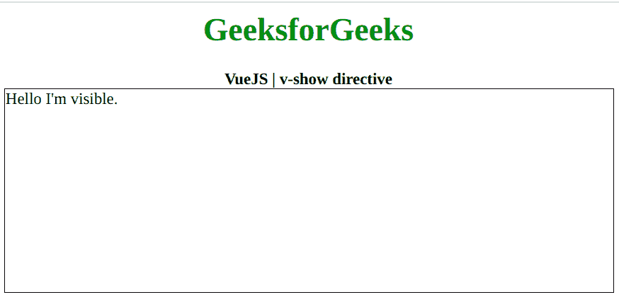
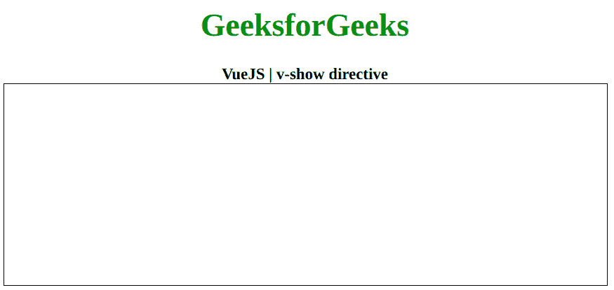

# vista . js | v-show 指令

> 哎哎哎:# t0]https://www . geeksforgeeks . org/view-js-v-show-directive/

**v-show** 指令是一个 [**Vue.js**](https://www.geeksforgeeks.org/vue-js-introduction-installation/) 指令，用于用我们的数据切换元素的显示 CSS 属性。如果数据是真的，它将使它可见，否则它将使它不可见。首先，我们将创建一个 id 为 *app* 的 div 元素，让我们将 *v-show* 指令应用于该元素，并将数据作为消息。现在，我们将通过用包含真或假的数据属性初始化 Vue 实例来创建这条消息。
**语法:**

```
v-show="data"
```

**参数:**该指令接受单个参数，即数据。
**示例 1:** 此示例使用 VueJS 以 v-show 显示元素。

## 超文本标记语言

```
<!DOCTYPE html>
<html>
    <head>
        <title>
            VueJS | v-show directive
        </title>

        <!-- Load Vuejs -->
        <script src=
"https://cdn.jsdelivr.net/npm/vue/dist/vue.js">
        </script>
    </head>

    <body>
        <div style="text-align: center; width: 600px;">
            <h1 style="color: green;">
                GeeksforGeeks
            </h1>
            <b>
                VueJS | v-show directive
            </b>
        </div>

        <div id="canvas" style="border: 1px solid #000000;
                                width: 600px; height: 200px;">
            <div v-show="message" id="app">
                Hello I'm visible.
            </div>
        </div>

        <script>
            var app = new Vue({
                el: "#app",
                data: {
                    message: true,
                },
            });
        </script>
    </body>
</html>
```

**输出:**



**示例 2:** 本示例使用 **VueJS** 隐藏带有 v-show 的元素。

## 超文本标记语言

```
<!DOCTYPE html>
<html>

<head>
    <title>
        VueJS | v-show directive
    </title>

    <!-- Load Vuejs -->
    <script src=
"https://cdn.jsdelivr.net/npm/vue/dist/vue.js">
    </script>
</head>

<body>
    <div style="text-align: center;width: 600px;">
        <h1 style="color: green;">
            GeeksforGeeks
        </h1>
        <b>
            VueJS | v-show directive
        </b>
    </div>

    <div id="canvas" style="border:1px solid #000000;
                            width: 600px;height: 200px;">
        <div v-show="message" id="app">
            Hello I'm invisible.
        </div>
    </div>

    <script>
        var app = new Vue({
            el: '#app',
            data: {
                message: false
            }
        })
    </script>
</body>

</html>
```

**输出:**

