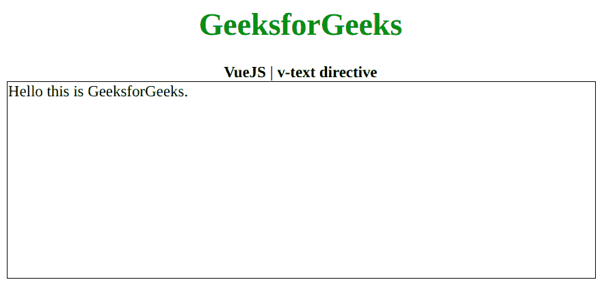

# vista . js | v-text 指令

> 哎哎哎:# t0]https://www . geeksforgeeks . org/view-js-v-text-directive/

**v-text** 指令是一个 [**Vue.js**](https://www.geeksforgeeks.org/vue-js-introduction-installation/) 指令，用于用我们的数据更新元素的 **textContent** 。它只是小胡子语法的一个很好的替代。首先，我们将创建一个 id 为 *app* 的 div 元素，让我们将 *v-text* 指令应用于该元素，并将数据作为消息。现在我们将通过初始化一个包含我们的消息的数据属性的 Vue 实例来创建这个消息。

**语法:**

```js
v-text="data"

```

**参数:**该指令接受单个参数，即数据。
**示例:**本示例使用 VueJS 用 v-text 更新元素的文本。

## 超文本标记语言

```js
<!DOCTYPE html>
<html>

<head>
    <title>
        VueJS | v-text directive
    </title>

    <!-- Load Vuejs -->
    <script src=
"https://cdn.jsdelivr.net/npm/vue/dist/vue.js">
    </script>
    </script>
</head>

<body>
    <div style="text-align: center;width: 600px;">
        <h1 style="color: green;">
            GeeksforGeeks
        </h1>
        <b>
            VueJS | v-text directive
        </b>
    </div>

    <div id="canvas" style="border:1px solid #000000;
                            width: 600px;height: 200px;">
        <div v-text="message" id="app">
        </div>
    </div>

    <script>
        var app = new Vue({
            el: '#app',
            data: {
                message: 'Hello this is GeeksforGeeks.'
            }
        })
    </script>
</body>

</html>

```

**输出:**

