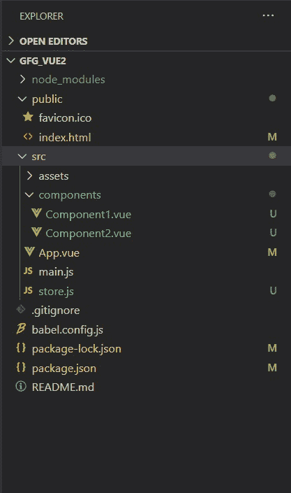
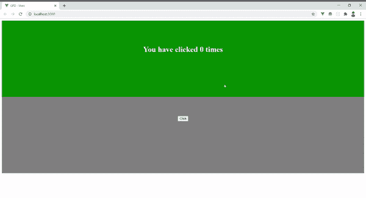

# vista . js vuex

> 哎哎哎:# t0]https://www . geeksforgeeks . org/view-js-vuex/

Vuex 是一个针对 Vue 应用程序的状态管理库。它在整个应用程序中充当单一的真实来源，并将数据流集中到不同的组件。正如我们所知，对于具有许多组件的复杂应用程序来说，传递道具可能会很繁琐，Vuex 使这种交互非常无缝和可扩展。

**先决条件:**

*   您应该在系统中安装 npm。然后，您需要使用以下命令安装 vue-cli:

    ```js
    npm install -g @vue/cli
    ```

*   然后使用以下命令创建一个新项目“gfg_vue2”(或您选择的任何名称):

    ```js
    vue create gfg_vue2
    ```

选择默认安装设置。

**项目结构:**会是这样的。



#### 将 Vuex 添加到您的应用程序

*   将 Vuex 添加到 Vue 中。JS 项目您可以通过 CDN 链接来完成，也可以通过在项目目录的终端中运行以下命令来添加:

    ```js
    npm install vuex –save
    ```

*   然后使用将它导入到所需的 JS 文件中

    ```js
    import Vuex from 'vuex'
    ```

**Vuex:** Vuex 有 3 个基本功能部件:

1.  **状态:**Vuex 存储中的状态对象是存储我们的应用程序组件的数据的地方。通过导入 Vuex 存储，然后在方法内部使用“store.state.storedVariable”，可以将它们访问到单个组件中。
2.  **突变:**状态变量可以在任何地方被访问，但是改变它们的唯一方法是通过提交突变。突变有一个字符串类型和一个处理程序，处理程序是在我们执行实际状态修改的存储中定义的。
3.  **动作:**动作类似于突变，只是它们实际上实施了突变。这看起来可能是多余的，因为突变也可以完成这个任务，但这是有原因的——突变是同步操作，因为它涉及状态变量的改变，而动作可以执行异步操作

**语法**

```js
import Vue from 'vue'
import Vuex from 'vuex'

Vue.use(Vuex)

export default new Vuex.Store({
    state: {
        // Define state variables as properties here
    },
    mutations: {
        // Mutation handlers (pass state object)
    },
    actions: {
        // Actions (pass context object)
    }
})
```

**示例:**我们将使用与我们在事件总线和$emit/props ( [在此为](https://www.geeksforgeeks.org/communication-between-components-using-emit-and-props-in-vue-js/))解释中使用的示例相同的示例。

每个 Vuex 应用程序的核心都是一个商店。它是保存应用程序状态的容器。它们是反应性的，只能通过提交突变来改变，从而防止任何组件隐式改变状态。

## Store.js

```js
import Vue from 'vue'
import Vuex from 'vuex'

Vue.use(Vuex)

export default new Vuex.Store({
    state: {
        n: 0
    },
    mutations: {
        change_n(state) {
            state.n++
        },
    },
    actions: {
        change_n(context) {
            context.commit('change_n')
        }
    }
})
```

## App.js

```js
<template>
<div>
  <Component1></Component1>
  <Component2></Component2>
</div>
</template>

<script>
import Component1 from './components/Component1.vue'
import Component2 from './components/Component2.vue'

export default {
  name: 'App',
  components: {
    Component1,Component2
  }
}
</script>

<style>

</style>
```

## 组件 1 .视图

```js
<template>
  <div class="component1">
    <h1>You have clicked {{ labeltext }} times</h1>
  </div>
</template>

<script>
//Importing store
import store from '../store';
export default {
  name: "Component1",
  computed: {
  labeltext () {
    //Accessing the store's state
    return store.state.n
  }
}
};
</script>

<style scoped>
.component1 {
  display: block;
  background-color: green;
  height: 15em;
  text-align: center;
  color: white;
  padding-top: 5em;
}
</style>
```

## 组件 2 .视图

```js
<template>
  <div class="component2">
    <button @click="count">Click</button>
  </div>
</template>

<script>
//Importing store
import store from '../store';
export default {
  name: "Component2",
  methods: {
    count() {
      //Triggering Actions with the store.dispatch method
      store.dispatch('change_n')
    },
  },
};
</script>

<style scoped>
.component2 {
  display: block;
  background-color: grey;
  height: 15em;
  text-align: center;
  padding-top: 5em;
}
</style>
```

**输出:**

