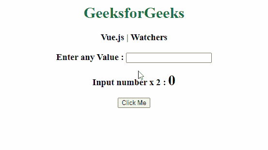
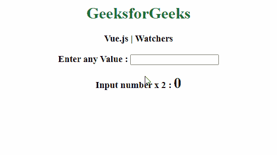

# vista . js watchers

> 哎哎哎:# t0]https://www . geeksforgeeks . org/view-js-watchers/

Vue.js 中的 **Watcher** 是一个特殊的特性，当组件的值发生变化时，它允许人们观察组件并执行指定的动作。这是观察 Vue 实例中的数据变化并对其做出反应的更通用的方法。观察者在执行异步操作时最有用**。**

**注意:**守望者一次只能改变一个属性。如果必须更改多个组件值，可以使用计算属性。

**语法:**

```
watch: {
   // We can add our functions here
}

```

Vue.js **Watchers** 可以用下面的例子来演示:

**示例:**我们将首先创建一个简单的 Vue.js 应用，不使用任何 Watcher **。**该程序的功能是通过点击按钮改变组件的值(输入值乘以 2)。

## 超文本标记语言

```
<!DOCTYPE html>
<html>

<head>
    <title>Vue.js Watchers</title>

    <script src=
        "https://unpkg.com/vue">
    </script>
</head>

<body>
    <h1 style="text-align: center; 
             color: rgb(27, 114, 53);">
        GeeksforGeeks
    </h1>

    <h3 style="text-align: center">
        Vue.js | Watchers
    </h3>

    <!-- Creating element for Vue -->
    <div style="text-align: center;" id="ex">
        <h3>Enter any Value :
            <input type="text" v-model="value1">
        </h3>
        <h3>Input number x 2 :
            <span style="font-size: 30px;">
                {{result}}
            </span>
        </h3>

        <!-- Creating a Button -->
        <button @click="multiply">
            Click Me
        </button>
    </div>

    <script>

        // Creating instance
        new Vue({
            el: '#ex',
            data: {

                // Setting values for fields
                value1: '',
                result: 0
            },
            methods: {

                // Creating function 
                // for button click
                multiply: function () {
                    this.result = this.value1 * 2;
                }
            }
        });
    </script>
</body>

</html>
```

**输出:**
点击按钮，结果值发生变化



在上例中，**结果的值**值仅在按钮点击时发生变化。我们现在将使用**手表**来注意输入组件的变化，并自动更新**结果**值。我们将定义**手表**，并在其中写入所需的功能，如下所示:

## java 描述语言

```
watch: {
    // Creating function
    // for input component
    value1: function(val) {
        this.value1 = val;
        this.result = 2 * val;
      },

    // Creating function
    // for result component
    result: function(val) {
        this.result = val;
    }
}
```

观察者现在寻找输入值的变化。每当输入值发生变化时，里面的函数自动执行(即输入值乘以 2)，结果**的值自动变化。我们不必专门分配任何事件并等待值的改变。我们将在前面的代码中添加上述更改，并移除按钮及其功能。**

**使用观察者的示例:**

## 超文本标记语言

```
<html>

<head>
    <title>Vue.js Watchers</title>

    <script src=
        "https://unpkg.com/vue">
    </script>
</head>

<body>
    <h1 style="text-align: center;
             color: rgb(27, 114, 53);">
        GeeksforGeeks
    </h1>

    <h3 style="text-align: center">
        Vue.js | Watchers
    </h3>

    <!-- Creating element for Vue -->
    <div style="text-align: center;" id="ex">
        <h3>Enter any Value :
            <input type="text" v-model="value1">
        </h3>
        <h3>Input number x 2 :
            <span style="font-size: 30px;">
                {{result}}
            </span>
        </h3>
    </div>

    <script>
        // Creating instance
        new Vue({
            el: '#ex',
            data: {
                // Setting values for fields
                value1: '',
                result: 0
            },
            // Creating a Watcher
            watch: {

                // Creating function for
                // input component
                value1: function (val) {
                    this.value1 = val;
                    this.result = 2 * val;
                },

                // Creating function for
                // result component
                result: function (val) {
                    this.result = val;
                }
            }
        });
    </script>
</body>

</html>
```

**输出:**
**结果**值在输入值变化时自动变化。

